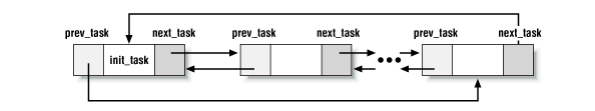

# Seminário de SO2 - Representação e criação de processos e *threads* - 2017/1

Este estudo explora a criação e a representação de processos e *threads* no sistema operacional Linux. Inicialmente serão apresentadas algumas definições primordiais e, posteriormente, serão analisados os códigos responsáveis pela criação de processos e também as estruturas de dados envolvidas na representação.

A versão do *kernel* utilizada foi a [http://elixir.free-electrons.com/linux/v4.11.7/source v4.11.7].

# Processo

De acordo com Tanenbaum [1], um processo é uma abstração de um programa em execução, acompanhado de valores atuais de seus registradores e das variáveis. Cada processo possui seu próprio controle de fluxo, controlado pelo contador de  programa, sendo que cada processo é executado de maneira independente.

Em geral, ocorre a execução simultânea de vários processos de maneira que os mesmos concorram pela utilização de recursos oferecidos, denotando assim um ambiente de multiprocessos.

# Thread

O modelo de processo é baseado em dois conceitos independentes: agrupamento de recursos e execução. *Threads* realizam a separação destes conceitos. A fim de compreendê-las, é importante denotar que um processo é um meio de agrupar recursos como a área de código, dados do programa, vetores de arquivos abertos, informações de recursos utilizados, entre outros; facilitando assim o seu gerenciamento [1].

*Threads* são linhas de execução de um processo escalonadas para executar. As *threads* possuem propriedades semelhantes ao processo, como contador de programa, variáveis de registradores atuais, a sua própria pilha, sendo portanto comumente chamadas de processos leves. Um processo pode conter diversas *threads* de execução, compartilhando entre si os recursos disponíveis, como as áreas de memória do processo indicadas pela tabela de páginas. Dessa forma é possível fazer com que haja cooperação entre as tarefas e, ao utilizar as *threads* de maneira adequada, melhorar o desempenho do processo [1].

É importante notar que cada processo possui ao menos uma *thread* associada a si, podendo criar outras *threads* de maneira dinâmica para auxiliar na execução do programa.

# Representação de um Processo ou Thread

No sistema operacional Linux, tanto processos quanto *threads* são tratados como sendo uma **task**. Uma *task* é representada por uma estrutura um tanto grande chamada *task_struct*. Esta estrutura contém os dados necessários para representar a *task* e algumas de suas relações com outras *tasks* [3].

## task_struct

O código a seguir apresenta a [http://elixir.free-electrons.com/linux/v4.11.7/source/include/linux/sched.h#L483 task_struct] de maneira resumida:

```C
    struct task_struct {
    #ifdef CONFIG_THREAD_INFO_IN_TASK
        /*
         * For reasons of header soup (see current_thread_info()), this
         * must be the first element of task_struct.
         */
        struct thread_info      thread_info;
    #endif
        /* -1 unrunnable, 0 runnable, >0 stopped: */
        volatile long           state;
        void                    *stack;
        /* Per task flags (PF_*), defined further below: */
        unsigned int            flags;
        unsigned int            ptrace;
        /* Current CPU: */
        unsigned int            cpu;
        int                     on_cpu;
    
        int                     on_rq;
    
        int                     prio;
        int                     static_prio;
        int                     normal_prio;
        unsigned int            rt_priority;
    
        const struct sched_class    *sched_class;
    
        unsigned int            policy;
        int                     nr_cpus_allowed;
        cpumask_t               cpus_allowed;
    
        struct list_head        tasks;
    
        struct mm_struct        *mm;
        struct mm_struct        *active_mm;
    
        int                     exit_state;
        int                     exit_code;
        int                     exit_signal;
        /* The signal sent when the parent dies: */
        int                     pdeath_signal;
    
        pid_t                   pid;
        pid_t                   tgid;
    
        /* Canary value for the -fstack-protector GCC feature: */
        unsigned long           stack_canary;
    
        /* Real parent process: */
        struct task_struct __rcu    *real_parent;
    
        /* Recipient of SIGCHLD, wait4() reports: */
        struct task_struct __rcu    *parent;
    
        /* Children/sibling form the list of natural children: */
        struct list_head        children;
        struct list_head        sibling;
        struct task_struct      *group_leader;
	
        struct completion       *vfork_done;
    
        /* CLONE_CHILD_SETTID: */
        int __user              *set_child_tid;
    
        /* CLONE_CHILD_CLEARTID: */
        int __user              *clear_child_tid;
    
        u64                     utime;
        u64                     stime;
        u64                     utimescaled;
        u64                     stimescaled;
        u64                     gtime;
        struct prev_cputime     prev_cputime;
    
        /* Monotonic time in nsecs: */
        u64                     start_time;
    
        /* Boot based time in nsecs: */
        u64                     real_start_time;
    
        /* Objective and real subjective task credentials (COW): */
        const struct cred __rcu     *real_cred;
    
        /* Effective (overridable) subjective task credentials (COW): */
        const struct cred __rcu     *cred;
    
    #ifdef CONFIG_SYSVIPC
        struct sysv_sem         sysvsem;
        struct sysv_shm         sysvshm;
    #endif
    
        /* Filesystem information: */
        struct fs_struct        *fs;
    
        /* Open file information: */
        struct files_struct     *files;
    
        /* Namespaces: */
        struct nsproxy          *nsproxy;
    
        /* Signal handlers: */
        struct signal_struct    *signal;
        struct sighand_struct   *sighand;
        sigset_t                blocked;
        sigset_t                real_blocked;
        /* Restored if set_restore_sigmask() was used: */
        sigset_t                saved_sigmask;
        struct sigpending       pending;
    
        /* Thread group tracking: */
        u32                     parent_exec_id;
        u32                     self_exec_id;
        
        /* Journalling filesystem info: */
        void                    *journal_info;
    
        /* Index of current stored address in ret_stack: */
        int                     curr_ret_stack;
    
        /* CPU-specific state of this task: */
        struct thread_struct    thread;
    
        /*
         * WARNING: on x86, 'thread_struct' contains a variable-sized
         * structure.  It *MUST* be at the end of 'task_struct'.
         *
         * Do not put anything below here!
         */
    };
```

Grande parte dos campos da *task_struct* já eram esperados, como uma *stack*, estado de execução, páginas da memória mapeadas, PID, vetor de arquivos abertos, informações do sistema de arquivos, política de escalonamento entre outras coisas.

O código [http://elixir.free-electrons.com/linux/v4.11.7/source/include/linux/sched.h#L68 linux/include/linux/sched.h#L68] define os estados de execução e de saída de uma *task*:

```C
    /* Used in tsk->state: */
    #define TASK_RUNNING            0       // Processo em execução ou na fila para rodar.
    #define TASK_INTERRUPTIBLE      1       // Processo bloqueado, esperando algum recurso.
                                                // Muda para a fila de prontos ao receber um sinal
    #define TASK_UNINTERRUPTIBLE    2       // Também está bloqueado, 
                                                // mas não muda para a fila de prontos ao receber o sinal.
    #define __TASK_STOPPED          4       // Execução do processo está congelada (Não está executando e nem pode executar).
    #define __TASK_TRACED           8       // Execução do processo parada por um debugger.
    /* Used in tsk->exit_state: */
    #define EXIT_DEAD               16      // Processo sendo removido do sistema.
    #define EXIT_ZOMBIE             32      // Processo terminado, esperando a chamada wait() do processo pai.
    #define EXIT_TRACE              (EXIT_ZOMBIE | EXIT_DEAD)
    /* Used in tsk->state again: */
    #define TASK_DEAD               64
    #define TASK_WAKEKILL           128
    #define TASK_WAKING             256
    #define TASK_PARKED             512
    #define TASK_NOLOAD             1024
    #define TASK_NEW                2048
    #define TASK_STATE_MAX          4096
```

O campo *flags* define diversas coisas, como se o processo está sendo criado (*PF_STARTING*) ou terminando (*PF_EXITING*) ou até mesmo se ele está alocando memória no momento (*PF_MEMALLOC*) [3].

O campo *tasks* provê a funcionalidade de lista duplamente encadeada, contendo um ponteiro para a *task* anterior (*prev*) e para a próxima *task* (*next*) [3].

O espaço de endereçamento do processo é representado pelos campos *mm* e *active_mm*. O *mm* representa os descritores de memória do processo enquanto o *active_mm* são os descritores de memória do processo anterior. Isso é feito para melhorar a *performance* na troca de contextos [3].

Os campos *children* e *sibling* são utilizados na lista duplamente encadeada, apresentados novamente no *copy_process()*.



A *thread_struct* depende da arquitetura sendo utilizada, sendo que para a x86_64 é possível ver seu código em [http://elixir.free-electrons.com/linux/v4.11.7/source/arch/x86/include/asm/processor.h#L422 linux/arch/x86/include/asm/processor.h#L422], com um fragmento apresentado abaixo:

```C
    struct thread_struct {
        /* Cached TLS descriptors: */
        struct desc_struct  tls_array[GDT_ENTRY_TLS_ENTRIES];
        unsigned long       sp0;
        unsigned long       sp;
    
        unsigned short      es;
        unsigned short      ds;
        unsigned short      fsindex;
        unsigned short      gsindex;
    
        u32                 status;     /* thread synchronous flags */
    
        unsigned long       fsbase;
        unsigned long       gsbase;
    
        unsigned long       fs;
        unsigned long       gs;
        
        /* Fault info: */
        unsigned long       cr2;
        unsigned long       trap_nr;
        unsigned long       error_code;
    
        mm_segment_t        addr_limit;
    
        /* Floating point and extended processor state */
        struct fpu          fpu;
    
        /* WARNING: 'fpu' is dynamically-sized.  It *MUST* be at the end. */
    };
```

### thread_info

É interessante observar, conforme descrito por Love [4], que a *task_struct* é alocada pelo *slab allocator* para prover reuso de objetos e *cache coloring*. Antes da versão 2.6 do *kernel*, a *task_struct* era alocada no fim da pilha do *kernel* para cada processo. Isso permitia que arquiteturas com poucos registradores, como a x86, pudessem calcular a posição do descritor de processo pelo ponteiro da pilha sem usar um registrador a mais para armazenar tal posição. Hoje o descritor de processos é dinamicamente criado pelo *slab allocator*, então a *struct* **thread_info** foi criada para apontar para a *task_struct*. Agora, a *thread_info*, que é relativamente pequena, se encontra no fim da pilha.

A seguir é apresentado a [http://elixir.free-electrons.com/linux/v4.11.7/source/arch/ia64/include/asm/thread_info.h#L21 código] da *thread_info*:

```C
    /*
     * On IA-64, we want to keep the task structure and kernel stack together, so they can be
     * mapped by a single TLB entry and so they can be addressed by the "current" pointer
     * without having to do pointer masking.
     */
    struct thread_info {
        struct task_struct *task;   /* XXX not really needed, except for dup_task_struct() */
        __u32 flags;                /* thread_info flags (see TIF_*) */
        __u32 cpu;                  /* current CPU */
        __u32 last_cpu;             /* Last CPU thread ran on */
        __u32 status;               /* Thread synchronous flags */
        mm_segment_t addr_limit;    /* user-level address space limit */
        int preempt_count;          /* 0=premptable, <0=BUG; will also serve as bh-counter */
    #ifdef CONFIG_VIRT_CPU_ACCOUNTING_NATIVE
        __u64 utime;
        __u64 stime;
        __u64 gtime;
        __u64 hardirq_time;
        __u64 softirq_time;
        __u64 idle_time;
        __u64 ac_stamp;
        __u64 ac_leave;
        __u64 ac_stime;
        __u64 ac_utime;
    #endif
    };
```

### PID

Cada processo é identificado unicamente por um *process ID*, chamado comumente de PID. PIDs são inteiros atribuídos sequencialmente pelo Sistema Operacional (SO) quando um novo processo é criado [2].

Como os processos no SO Linux são criados a partir de um processo já existente (à exceção do processo *init*), a cada processo está associado, além do PID, um  *parent PID* (PPID).

Existe um tipo próprio para representar PIDs, chamado *pid_t*, apontado a seguir (definido em [http://elixir.free-electrons.com/linux/v4.11.7/source/include/linux/types.h#L21 linux/include/linux/types.h#L21]:

```C
    typedef __kernel_pid_t      pid_t;
```

Onde *__kernel_pid_t*, por sua vez, é estabelecido como um *int* em [http://elixir.free-electrons.com/linux/v4.11.7/source/include/uapi/asm-generic/posix_types.h#L27 linux/include/uapi/asm-generic/posix_types.h#L27]:

```C
    #ifndef __kernel_pid_t
    typedef int     __kernel_pid_t;
    #endif
```

O fragmento de código a seguir apresenta onde a *task_struct* armazena o [http://elixir.free-electrons.com/linux/v4.11.7/source/include/linux/sched.h#L616 pid] e o tgid

```C
    ...
    pid_t               pid;
    pid_t               tgid;
    ...
```

Para o kernel, [http://elixir.free-electrons.com/linux/v4.11.7/source/include/linux/sched.h#L617 tgid] é o que para o usuário é o PID, como pode ser visto no [http://man7.org/linux/man-pages/man2/clone.2.html manual do clone] 

    Thread groups were a feature added in Linux 2.4 to support the
    POSIX threads notion of a set of threads that share a single
    PID.  Internally, this shared PID is the so-called thread
    group identifier (TGID) for the thread group.  Since Linux
    2.4, calls to getpid(2) return the TGID of the caller.

E [http://elixir.free-electrons.com/linux/v4.11.7/source/include/linux/sched.h#L616 pid] é um identificador único para cada *task_struct*, cada pid identifica uma linha de execução, ou thread, diferente. Como pode ser deduzido do [http://man7.org/linux/man-pages/man2/clone.2.html manual do clone]

    The threads within a group can be distinguished by their
    (system-wide) unique thread IDs (TID).  A new thread's TID is
    available as the function result returned to the caller of
    clone(), and a thread can obtain its own TID using gettid(2).
    
    When a call is made to clone() without specifying
    CLONE_THREAD, then the resulting thread is placed in a new
    thread group whose TGID is the same as the thread's TID.  This
    thread is the leader of the new thread group.

juntamente com o [http://man7.org/linux/man-pages/man2/gettid.2.html manual do gettid]

    gettid() returns the caller's thread ID (TID).  In a single-threaded
    process, the thread ID is equal to the process ID (PID, as returned
    by getpid(2)).  In a multithreaded process, all threads have the same
    PID, but each one has a unique TID.  For further details, see the
    discussion of CLONE_THREAD in clone(2).

# Criação de Processos e Threads

O código central em nossa análise é o [http://elixir.free-electrons.com/linux/v4.11.7/source/kernel/fork.c#L1967 linux/kernel/fork.c] (de agora em diante chamado de 'fork.c', que contém sobretudo as funcionalidades necessárias para efetuar a chamada *fork()*, responsável por criar um novo processo, e chamadas similares.

## fork()

Segundo o manual do Linux, o comando fork() cria um novo processo duplicando o processo que realiza a chamada (chamado aqui de processo pai). O processo criado (chamado de processo filho) é uma cópia praticamente exata do processo pai, exceto que o processo filho não herda, essencialmente:

* As *memory locks* do pai;
* Os ajustes de semáforos do pai (feitos através de semop(2));
* As *record locks* associadas a um processo por seu pai com fcntl(2);
* Os *timers* do seu pai;
* As operações ou contextos assíncronos de entrada e saída pendentes de seu pai.

Além, é claro, de possuir um PID único, um PPID igual ao PID do processo pai, ter seu uso de recursos (getrusage(2)) e contadores de tempo de CPU (times(2)) resetados e seu conjunto de sinais pendentes esvaziados. Essas são as diferenças fundamentais existentes entre o processo pai e o processo filho recém criado.

A chamada de sistema fork() é definida em [http://elixir.free-electrons.com/linux/v4.11.7/source/kernel/fork.c#L2063 fork.c#L2063], como mostrada no fragmento de código abaixo:

```C
    #ifdef __ARCH_WANT_SYS_FORK
    SYSCALL_DEFINE0(fork)
    {
    #ifdef CONFIG_MMU
        return _do_fork(SIGCHLD, 0, 0, NULL, NULL, 0);
    #else
        /* can not support in nommu mode */
        return -EINVAL;
    #endif
    }
    #endif
```

Ou seja, o código da chamada de sistema *fork()* é basicamente
    
```C    
    _do_fork(SIGCHLD, 0, 0, NULL, NULL, 0);
```

A função *_do_fork()* é explicada de forma mais detalhada posteriormente. O parâmetro SIGCHLD é definido em [http://elixir.free-electrons.com/linux/v4.11.7/source/arch/x86/include/uapi/asm/signal.h#L39 linux/arch/x86/include/uapi/asm/signal.h#L39] como

```C
    #define SIGCHLD     17
```

e é utilizado para especificar qual é o sinal de retorno a ser enviado para o processo pai quando o filho termina.

## vfork()

Assim como a chamada de sistema *fork()*, esta chamada também é utilizada para criar um processo filho. A principal diferença entre tais chamadas é que *vfork()* não copia as tabelas de página do processo pai, sendo utilizada para obter maior desempenho em casos em que uma chamada *execve()* é realizada logo após a criação do processo.

Vale notar que atualmente tal chamada é marcada como sendo obsoleta, haja vista que a chamada *fork()* passou a utilizar técnicas de *copy-on-write*, obtendo uma *performance* equivalente a da *vfork()*.

Ela é definida em [http://elixir.free-electrons.com/linux/v4.11.7/source/kernel/fork.c#L2075 fork.c#L2075] como

```C
    #ifdef __ARCH_WANT_SYS_VFORK
    SYSCALL_DEFINE0(vfork)
    {
        return _do_fork(CLONE_VFORK | CLONE_VM | SIGCHLD, 0, 0, NULL, NULL, 0);
    }
    #endif
```

A *flag* *CLONE_VFORK* indica que o processo pai quer que o filho acorde com o *mm_release*, utilizada para indicar que é a chamada *vfork()* e a *flag* *CLONE_VM* diz que a memória virtual é compartilhada entre os dois processos.

## clone()

A função [http://elixir.free-electrons.com/linux/v4.11.7/source/kernel/fork.c#L2084 clone()] é uma interface da glibc para múltiplas chamadas de sistema, o qual realiza a criação de *task*.

A função *clone()* recebe os seguintes parâmetros, como pode-se ver no protótipo abaixo retirado do manual do Linux:

```C
    // Protótipo para a função clone da glibc:
    int clone(int (*fn)(void *), void *child_stack,
                     int flags, void *arg, ...
                     /* pid_t *ptid, struct user_desc *tls, pid_t *ctid */ );
```

A chamada *clone()* tem como retorno o TID (*thread* ID) da *task* filha quando for realizada com sucesso; caso contrário será retornado -1 e um *ERRNO* será definido apropriadamente.

Diferentemente do *fork()*, o *clone()* permite que processos filhos compartilhem recursos do processo pai. Como por exemplo áreas de memória, vetor de arquivos abertos, *signal handlers* dentre outros. Isto é definido através das *flags* passadas para a *syscall*.

A syscall do clone é definida em [http://elixir.free-electrons.com/linux/v4.11.7/source/kernel/fork.c#L2082 linux/kernel/fork.c#L2082]:

```C
    #ifdef __ARCH_WANT_SYS_CLONE
    #ifdef CONFIG_CLONE_BACKWARDS
    SYSCALL_DEFINE5(clone, unsigned long, clone_flags, unsigned long, newsp,
             int __user *, parent_tidptr,
             unsigned long, tls,
             int __user *, child_tidptr)
    #elif defined(CONFIG_CLONE_BACKWARDS2)
    SYSCALL_DEFINE5(clone, unsigned long, newsp, unsigned long, clone_flags,
             int __user *, parent_tidptr,
             int __user *, child_tidptr,
             unsigned long, tls)
    #elif defined(CONFIG_CLONE_BACKWARDS3)
    SYSCALL_DEFINE6(clone, unsigned long, clone_flags, unsigned long, newsp,
            int, stack_size,
            int __user *, parent_tidptr,
            int __user *, child_tidptr,
            unsigned long, tls)
    #else
    SYSCALL_DEFINE5(clone, unsigned long, clone_flags, unsigned long, newsp,
             int __user *, parent_tidptr,
             int __user *, child_tidptr,
             unsigned long, tls)
    #endif
    {
        return _do_fork(clone_flags, newsp, 0, parent_tidptr, child_tidptr, tls);
    }
    #endif
```

Basicamente, a chamada de sistema *clone()* chama a *_do_fork()* passando mais argumentos do que as chamadas *fork()* ou *vfork()*. Devido às *flags* passadas, *clone()* provê maior flexibilidade dentre estas 3 funções, tendo controle sobre o compartilhamento de recursos entre o processo pai e filho.

### Parâmetros

A função *clone()* da glibc possui os seguintes argumentos:

* **fn**: quando o processo é criado por *clone()*, este executa a função *fn(arg)*. *fn* é um ponteiro para uma função que é invocada pelo processo filho no início da sua execução. Os argumentos para esta função são passados através do parâmetro *arg*.

* **child_stack**: especifica o endereço da pilha utilizada pelo processo filho. O processo pai deve alocar um espaço de memória para a pilha do filho e passar o ponteiro deste espaço para o *clone()*.

* **flags**: constantes que indicam o que será compartilhado entre o processo pai e o processo filho, como, por exemplo, os vetores de arquivos abertos, as páginas da memória virtual, *signal handlers*, entre outros. Pode-se conferir as *flags* na seção abaixo.

### Retorno da função

Quando a função do  processo filho encerrar, este retornará o valor da função passada e será o código de saída para o processo filho (a thread do processo filho também pode ser terminada explicitamente chamando *exit(2)* ou recebendo um sinal). 

Além disso, segundo o manual, o byte menos significativo contém o número do *termination signal*, que é enviado quando o processo filho termina. Se nenhum sinal é especificado diferentemente de *SIGCHLD*, então o processo pai deve especificar a opção *__WALL* ou *__WCLONE* quando espera pelo filho com wait(2).

## Clone flags

Em [http://elixir.free-electrons.com/linux/v4.11.7/source/include/uapi/linux/sched.h linux/include/uapi/linux/sched.h] estão definidas as políticas de escalonamento e as *cloning flags*, apresentadas abaixo:

```C
    #define CSIGNAL              0x000000ff  /* signal mask to be sent at exit */
    #define CLONE_VM             0x00000100  /* set if VM shared between processes */
    #define CLONE_FS             0x00000200  /* set if fs info shared between processes */
    #define CLONE_FILES          0x00000400  /* set if open files shared between processes */
    #define CLONE_SIGHAND        0x00000800  /* set if signal handlers and blocked signals shared */
    #define CLONE_PTRACE         0x00002000  /* set if we want to let tracing continue on the child too */
    #define CLONE_VFORK          0x00004000  /* set if the parent wants the child to wake it up on mm_release */
    #define CLONE_PARENT         0x00008000  /* set if we want to have the same parent as the cloner */
    #define CLONE_THREAD         0x00010000  /* Same thread group? */
    #define CLONE_NEWNS          0x00020000  /* New mount namespace group */
    #define CLONE_SYSVSEM        0x00040000  /* share system V SEM_UNDO semantics */
    #define CLONE_SETTLS         0x00080000  /* create a new TLS for the child */
    #define CLONE_PARENT_SETTID  0x00100000  /* set the TID in the parent */
    #define CLONE_CHILD_CLEARTID 0x00200000  /* clear the TID in the child */
    #define CLONE_DETACHED       0x00400000  /* Unused, ignored */
    #define CLONE_UNTRACED       0x00800000  /* set if the tracing process can't force CLONE_PTRACE on this clone */
    #define CLONE_CHILD_SETTID   0x01000000  /* set the TID in the child */
    #define CLONE_NEWCGROUP      0x02000000  /* New cgroup namespace */
    #define CLONE_NEWUTS         0x04000000  /* New utsname namespace */
    #define CLONE_NEWIPC         0x08000000  /* New ipc namespace */
    #define CLONE_NEWUSER        0x10000000  /* New user namespace */
    #define CLONE_NEWPID         0x20000000  /* New pid namespace */
    #define CLONE_NEWNET         0x40000000  /* New network namespace */
    #define CLONE_IO             0x80000000  /* Clone io context */
```

## _do_fork()

A função *_do_fork()* é responsável por realizar de fato o que se espera da criação de uma nova *task*.

Seu código é apresentado abaixo

```C
    /*
     *  Ok, this is the main fork-routine.
     *
     * It copies the process, and if successful kick-starts
     * it and waits for it to finish using the VM if required.
     */
    long _do_fork(unsigned long clone_flags,
              unsigned long stack_start,
              unsigned long stack_size,
              int __user *parent_tidptr,
              int __user *child_tidptr,
              unsigned long tls)
    {
        struct task_struct *p;
        int trace = 0;
        long nr;
        
        /*
         * Determine whether and which event to report to ptracer.  When
         * called from kernel_thread or CLONE_UNTRACED is explicitly
         * requested, no event is reported; otherwise, report if the event
         * for the type of forking is enabled.
         */
        if (!(clone_flags & CLONE_UNTRACED)) {
            if (clone_flags & CLONE_VFORK)
                trace = PTRACE_EVENT_VFORK;
            else if ((clone_flags & CSIGNAL) != SIGCHLD)
                trace = PTRACE_EVENT_CLONE;
            else
                trace = PTRACE_EVENT_FORK;
        
            if (likely(!ptrace_event_enabled(current, trace)))
                trace = 0;
        }
        
        p = copy_process(clone_flags, stack_start, stack_size,
                 child_tidptr, NULL, trace, tls, NUMA_NO_NODE);
        add_latent_entropy();
        /*
         * Do this prior waking up the new thread - the thread pointer
         * might get invalid after that point, if the thread exits quickly.
         */
        if (!IS_ERR(p)) {
            struct completion vfork;
            struct pid *pid;
        
            trace_sched_process_fork(current, p);
        
            pid = get_task_pid(p, PIDTYPE_PID);
            nr = pid_vnr(pid);
        
            if (clone_flags & CLONE_PARENT_SETTID)
                put_user(nr, parent_tidptr);
        
            if (clone_flags & CLONE_VFORK) {
                p->vfork_done = &vfork;
                init_completion(&vfork);
                get_task_struct(p);
            }
        
            wake_up_new_task(p);
        
            /* forking complete and child started to run, tell ptracer */
            if (unlikely(trace))
                ptrace_event_pid(trace, pid);
        
            if (clone_flags & CLONE_VFORK) {
                if (!wait_for_vfork_done(p, &vfork))
                    ptrace_event_pid(PTRACE_EVENT_VFORK_DONE, pid);
            }
        
            put_pid(pid);
        } else {
            nr = PTR_ERR(p);
        }
        return nr;
    }
```

### Parâmetros

```C
    long _do_fork(unsigned long clone_flags,
                  unsigned long stack_start,
                  unsigned long stack_size,
                  int __user    *parent_tidptr,
                  int __user    *child_tidptr,
                  unsigned long tls)
```

A função *_do_fork()* recebe os seguintes parâmetros:

* **clone_flags**: *Flags* que especificam quais áreas da memória devem ser copiadas para o filho e outras informações, como qual sinal deve ser enviado ao processo pai quando o filho terminar (no caso do *fork()*, por exemplo, é o sinal *SIGCHLD*);

* **stack_start**: Ponteiro da pilha a ser atribuído ao registrador esp do processo filho;

* **stack_size**: Utilizado apenas no *copy_thread_tls()*, ver discussão em [5], onde se debate que este parâmetro é utilizado somente ao fazer um *fork* de *kernel thread* para passar argumentos, e nunca como uma *stack size*. Sugere-se então para mudar o nome para *kthread_arg*;

* ***parent_tidptr**: Especifica o endereço de uma variável do processo pai para guardar o PID da nova thread (ver a *flag* CLONE_PARENT_SETID);

* ***child_tidptr**: Especifica o endereço de uma variável da nova thread para guardar seu PID (ver a *flag* CLONE_CHILD_SETTID);

* **tls**: É o endereço de uma *Thread Local Storage* (TLS) para a nova *thread* (ver *flag* *CLONE_SETTLS*).

### Retorno da função

Como já se sabe, a função *fork()* retorna o PID do processo filho para o pai e o valor 0 para o filho. Ao observar o código acima, nota-se que a variável **nr** é utilizada como retorno da função *_do_fork()*.

Na linha 

```C
    nr = pid_vnr(pid);
```

o valor do PID do filho é passado para a variável *nr* e será retornado para o processo pai, mas há de se notar que é necessário realizar mais do que isso para retornar 0 para o processo filho.

Para entender como esse valor é passado, é necessário olhar a função *copy_thread_tls()*. Essa função depende da plataforma em questão, e para a arquitetura X86_64 ela é definida em [http://elixir.free-electrons.com/linux/v4.11.7/source/arch/x86/kernel/process_64.c#L146 linux/arch/x86/kernel/process_64.c#L146].

A função *_do_fork()* chama a [http://elixir.free-electrons.com/linux/latest/source/kernel/fork.c#L1491 copy_process()], que na linha [http://elixir.free-electrons.com/linux/latest/source/kernel/fork.c#L1718 1718] (mostrada abaixo) chama a *copy_thread_tls()*.

```C
    ...
    retval = copy_thread_tls(clone_flags, stack_start, stack_size, p, tls);
    ...
```

A *copy_thread_tls()* então é responsável por copiar as estruturas de dados de armazenamento local relacionadas à *thread*.

```C
    int copy_thread_tls(unsigned long clone_flags, unsigned long sp,
            unsigned long arg, struct task_struct *p, unsigned long tls)
    {
        int err;
        struct pt_regs *childregs;
        struct fork_frame *fork_frame;
        struct inactive_task_frame *frame;
        struct task_struct *me = current;
    
        p->thread.sp0 = (unsigned long)task_stack_page(p) + THREAD_SIZE;
        childregs = task_pt_regs(p);
        fork_frame = container_of(childregs, struct fork_frame, regs);
        frame = &fork_frame->frame;
        frame->bp = 0;
        frame->ret_addr = (unsigned long) ret_from_fork;
        p->thread.sp = (unsigned long) fork_frame;
        p->thread.io_bitmap_ptr = NULL;
    
        savesegment(gs, p->thread.gsindex);
        p->thread.gsbase = p->thread.gsindex ? 0 : me->thread.gsbase;
        savesegment(fs, p->thread.fsindex);
        p->thread.fsbase = p->thread.fsindex ? 0 : me->thread.fsbase;
        savesegment(es, p->thread.es);
        savesegment(ds, p->thread.ds);
        memset(p->thread.ptrace_bps, 0, sizeof(p->thread.ptrace_bps));
    
        if (unlikely(p->flags & PF_KTHREAD)) {
            /* kernel thread */
            memset(childregs, 0, sizeof(struct pt_regs));
            frame->bx = sp;     /* function */
            frame->r12 = arg;
            return 0;
        }
        frame->bx = 0;
        *childregs = *current_pt_regs();
    
        childregs->ax = 0;
        if (sp)
            childregs->sp = sp;
    
        err = -ENOMEM;
        if (unlikely(test_tsk_thread_flag(me, TIF_IO_BITMAP))) {
            p->thread.io_bitmap_ptr = kmemdup(me->thread.io_bitmap_ptr,
                              IO_BITMAP_BYTES, GFP_KERNEL);
            if (!p->thread.io_bitmap_ptr) {
                p->thread.io_bitmap_max = 0;
                return -ENOMEM;
            }
            set_tsk_thread_flag(p, TIF_IO_BITMAP);
        }
    
        /*
         * Set a new TLS for the child thread?
         */
        if (clone_flags & CLONE_SETTLS) {
    #ifdef CONFIG_IA32_EMULATION
            if (in_ia32_syscall())
                err = do_set_thread_area(p, -1,
                    (struct user_desc __user *)tls, 0);
            else
    #endif
                err = do_arch_prctl(p, ARCH_SET_FS, tls);
            if (err)
                goto out;
        }
        err = 0;
    out:
        if (err && p->thread.io_bitmap_ptr) {
            kfree(p->thread.io_bitmap_ptr);
            p->thread.io_bitmap_max = 0;
        }
    
        return err;
    }
```

Esta função cria um novo *stack frame* e ajusta o valores de seus segmentos corretamente.

A variável *childregs* é do tipo *struct *pt_regs* e representa os valores dos registradores daquela *task*, como apresentado abaixo:

```C
    struct pt_regs {
        ...
        unsigned long r15;
        unsigned long r14;
        unsigned long r13;
        unsigned long r12;
        unsigned long bp;
        unsigned long bx;
        ...
        unsigned long r11;
        unsigned long r10;
        unsigned long r9;
        unsigned long r8;
        unsigned long ax;
        unsigned long cx;
        unsigned long dx;
        unsigned long si;
        unsigned long di;
    /*
     * On syscall entry, this is syscall#. On CPU exception, this is error code.
     * On hw interrupt, it's IRQ number:
     */
        unsigned long orig_ax;
    /* Return frame for iretq */
        unsigned long ip;
        unsigned long cs;
        unsigned long flags;
        unsigned long sp;
        unsigned long ss;
    /* top of stack page */
    };
```

e na linha destacada abaixo, da função copy_thread_tls(), seta o valor do registrador **ax** como 0.

```C
    childregs->ax = 0;
```

Por convenção, sabe-se que o retorno das funções é passado pelo registrador ax. Portanto, esta é a forma pela qual a chamada fork() é capaz de retornar adequadamente os valores desejados para tanto o processo filho quanto para o processo pai.

### wake_up_new_task()

A função [http://elixir.free-electrons.com/linux/v4.11.7/source/kernel/sched/core.c wake_up_new_task()] é responsável por colocar a *task* recém criada na *runqueue* pela primeira vez.

Ela seta o estado da *task* para TASK_RUNNING e chama o *__set_task_cpu()*, que por sua vez chama o *select_task_rq()*.

```C
	/*
	 * wake_up_new_task - wake up a newly created task for the first time.
	 *
	 * This function will do some initial scheduler statistics housekeeping
	 * that must be done for every newly created context, then puts the task
	 * on the runqueue and wakes it.
	 */
	void wake_up_new_task(struct task_struct *p)
	{
		struct rq_flags rf;
		struct rq *rq;
	
		raw_spin_lock_irqsave(&p->pi_lock, rf.flags);
		p->state = TASK_RUNNING;
	#ifdef CONFIG_SMP
		/*
		 * Fork balancing, do it here and not earlier because:
		 *  - cpus_allowed can change in the fork path
		 *  - any previously selected CPU might disappear through hotplug
		 *
		 * Use __set_task_cpu() to avoid calling sched_class::migrate_task_rq,
		 * as we're not fully set-up yet.
		 */
		__set_task_cpu(p, select_task_rq(p, task_cpu(p), SD_BALANCE_FORK, 0));
	#endif
		rq = __task_rq_lock(p, &rf);
		update_rq_clock(rq);
		post_init_entity_util_avg(&p->se);
	
		activate_task(rq, p, 0);
		p->on_rq = TASK_ON_RQ_QUEUED;
		trace_sched_wakeup_new(p);
		check_preempt_curr(rq, p, WF_FORK);
	#ifdef CONFIG_SMP
		if (p->sched_class->task_woken) {
			/*
			 * Nothing relies on rq->lock after this, so its fine to
			 * drop it.
			 */
			rq_unpin_lock(rq, &rf);
			p->sched_class->task_woken(rq, p);
			rq_repin_lock(rq, &rf);
		}
	#endif
		task_rq_unlock(rq, p, &rf);
	}
```

### select_task_rq()

A função [http://elixir.free-electrons.com/linux/v4.11.7/source/kernel/sched/core.c#L1553 select_task_rq()], apresentada abaixo, seleciona uma CPU disponível, baseando também no escalonador referente à política de escalonamento a ser utilizada para a *task* (e.g., *fair*), levando em conta também a afinidade da *task* com as CPUs e o campo *cpus_allowed* da *task_struct*.

```C
	/*
	 * The caller (fork, wakeup) owns p->pi_lock, ->cpus_allowed is stable.
	 */
	static inline
	int select_task_rq(struct task_struct *p, int cpu, int sd_flags, int wake_flags)
	{
		lockdep_assert_held(&p->pi_lock);
	
		if (p->nr_cpus_allowed > 1)
			cpu = p->sched_class->select_task_rq(p, cpu, sd_flags, wake_flags);
		else
			cpu = cpumask_any(&p->cpus_allowed);
	
		/*
		 * In order not to call set_task_cpu() on a blocking task we need
		 * to rely on ttwu() to place the task on a valid ->cpus_allowed
		 * CPU.
		 *
		 * Since this is common to all placement strategies, this lives here.
		 *
		 * [ this allows ->select_task() to simply return task_cpu(p) and
		 *   not worry about this generic constraint ]
		 */
		if (unlikely(!cpumask_test_cpu(cpu, &p->cpus_allowed) ||
				 !cpu_online(cpu)))
			cpu = select_fallback_rq(task_cpu(p), p);
	
		return cpu;
	}
```

## do_fork()

Existe também uma função chamada *do_fork()*, por motivos de compatibilidade com arquiteturas que chamam *do_fork()* diretamente:

```C
    #ifndef CONFIG_HAVE_COPY_THREAD_TLS
    /* For compatibility with architectures that call do_fork directly rather than
     * using the syscall entry points below. */
    long do_fork(unsigned long clone_flags,
              unsigned long stack_start,
              unsigned long stack_size,
              int __user *parent_tidptr,
              int __user *child_tidptr)
    {
        return _do_fork(clone_flags, stack_start, stack_size,
                parent_tidptr, child_tidptr, 0);
    }
    #endif
```

Basicamente, ela chama *_do_fork()* com o parâmetro *tls = 0*.

## pthreads

Para dar suporte para as threads POSIX, o linux fornece uma
flag, [http://elixir.free-electrons.com/linux/v4.11.7/source/include/uapi/linux/sched.h#L15 CLONE_THREAD],
para a chamada de sistema [http://elixir.free-electrons.com/linux/v4.11.7/source/kernel/fork.c#L2100 clone].
Essa flag faz com que o filho tenha o mesmo PID que o pai,
criando uma linha de execução no mesmo PID da linha que a chamou,
ou seja, uma thread.

; Observa-se abaixo como o [http://elixir.free-electrons.com/linux/v4.11.7/source/kernel/fork.c#L1759 código] do kernel faz uso da flag

```C
    ...
    p->pid = pid_nr(pid);
    if (clone_flags & CLONE_THREAD) {
        p->exit_signal = -1;
        p->group_leader = current->group_leader;
        p->tgid = current->tgid;
    } else {
        if (clone_flags & CLONE_PARENT)
            p->exit_signal = current->group_leader->exit_signal;
        else
            p->exit_signal = (clone_flags & CSIGNAL);
        p->group_leader = p;
        p->tgid = p->pid;
    }
    ...
```

*p* é a nova [http://elixir.free-electrons.com/linux/v4.11.7/source/include/linux/sched.h#L483 task_struct]
e *current* é a [http://elixir.free-electrons.com/linux/v4.11.7/source/include/linux/sched.h#L483 task_struct] do chamador.

Quando passada a *flag* [http://elixir.free-electrons.com/linux/v4.11.7/source/include/uapi/linux/sched.h#L15 CLONE_THREAD],
o [http://elixir.free-electrons.com/linux/v4.11.7/source/include/linux/sched.h#L617 tgid] do pai é passado para o filho.
Ou seja, na visão do usuário, os dois processos tem o mesmo PID.

As *threads* também precisam ter o mesmo tratamento de sinais e compartilhar memória. Isso é especificado no [http://man7.org/linux/man-pages/man2/clone.2.html manual do clone]

    Since Linux 2.5.35, flags must also include CLONE_SIGHAND if
    CLONE_THREAD is specified (and note that, since Linux
    2.6.0-test6, CLONE_SIGHAND also requires CLONE_VM to be
    included).

E reforçado no [http://elixir.free-electrons.com/linux/v4.11.7/source/kernel/fork.c#L1510 código]:

```C
    /*
     * Thread groups must share signals as well, and detached threads
     * can only be started up within the thread group.
     */
    if ((clone_flags & CLONE_THREAD) && !(clone_flags & CLONE_SIGHAND))
        return ERR_PTR(-EINVAL);
    
    /*
     * Shared signal handlers imply shared VM. By way of the above,
     * thread groups also imply shared VM. Blocking this case allows
     * for various simplifications in other code.
     */
    if ((clone_flags & CLONE_SIGHAND) && !(clone_flags & CLONE_VM))
        return ERR_PTR(-EINVAL);
```

## copy_process()

A função [http://elixir.free-electrons.com/linux/v4.11.7/source/kernel/fork.c#L1491 copy_process()] é responsável por realmente criar a nova *task* como cópia da antiga. Ela é chamada por duas funções, a *_do_fork()* e a *fork_idle()*. 

A função *fork_idle()* cria uma *idle thread* (*thread* ociosa), usada para economizar energia quando não há trabalho a ser feito, até outra *thread* desejar ser reescalonada.

### Parâmetros

```C
    static __latent_entropy struct task_struct *copy_process(
                        unsigned long clone_flags,  // Flags do clone
                        unsigned long stack_start,  // Ponteiro da pilha a ser atribuído ao registrador esp do processo filho
                        unsigned long stack_size,   // Tamanho da pilha que pode ser atribuído (sempre passado o valor 0)
                        int __user *child_tidptr,   // Se usou a flag CLONE_CHILD_SETTID, seta o campo set_child_tid da task_struct
                        struct pid *pid,            // PID previamente alocado
                        int trace,                  // Flag para o ptracer
                        unsigned long tls,          // Endereço de onde é definido o Armazenamento Local de Thread
                        int node)                   // Número do node em que está a task
```

A função *copy_process()* recebe os seguintes parâmetros:

clone_flags, stack_start, stack_size, child_tidptr e tls, que já foram explicadas na seção de parâmetros da função *do_fork()*, além de

* **pid**: PID que pode ser previamente alocado e passado. Também pode ser passado o valor *NULL* para que este seja alocado dentro da função *copy_process()*.

* **trace**: Flags que determinam qual evento reportar ao *ptracer* (e se o evento deve ser reportado).

* **node**: Node no qual está (ou deve ser) alocada a *task*.

A função *_do_fork()*, como mostrado anteriormente, chama a função *copy_process()* com os parâmetros **pid* = *NULL* e *node* = *NUMA_NO_NODE*, enquanto que os outros parâmetros são os mesmos parâmetros passados ao próprio *_do_fork()*. Já a função *fork_idle()* chama a função *copy_process()* com os parâmetros a seguir:

```C
    struct task_struct *fork_idle(int cpu)
    {
        ...
        task = copy_process(CLONE_VM, 0, 0, NULL, &init_struct_pid, 0, 0, cpu_to_node(cpu));
        ...
    }
```
 
### Retorno da função

A função *copy_process()* retorna um ponteiro para a *task struct* da *task* criada (a variável **p**), se não houver nenhum erro em sua execução. Caso contrário, a função retorna um ponteiro para erros *ERR_PTR*, que basicamente indica o número do erro que ocorreu, referenciado pela variável **retval**.

Um ponto importante ao se notar na implementação do *fork*, como descrito por Love [4], é que se o retorno do *copy_process()* for sucedido, o *kernel* executa (pelo menos na teoria), a *task* filha primeiro. Isso é planejado para que, se a *tasḱ* filha chama a função *exec()* imediatamente após o *fork()*, se elimina qualquer *overhead* de *copy-on-write* que poderia ocorrer caso a *task* pai execute primeiro e escreva no espaço de endereçamento.

### Execução da função

Em termos gerais, conforme descrito por Love [4], a função *copy_process()* executa os seguintes passos:

* Verifica se foram "setadas" *flags* que não deveriam estar juntas:

```C
    static __latent_entropy struct task_struct *copy_process(...)
    {
        int retval;
        struct task_struct *p;
    
        if ((clone_flags & (CLONE_NEWNS|CLONE_FS)) == (CLONE_NEWNS|CLONE_FS))
            return ERR_PTR(-EINVAL);
    
        if ((clone_flags & (CLONE_NEWUSER|CLONE_FS)) == (CLONE_NEWUSER|CLONE_FS))
            return ERR_PTR(-EINVAL);
    
        ...
        if ((clone_flags & CLONE_THREAD) && !(clone_flags & CLONE_SIGHAND))
            return ERR_PTR(-EINVAL);
    
        ...
        if ((clone_flags & CLONE_SIGHAND) && !(clone_flags & CLONE_VM))
            return ERR_PTR(-EINVAL);
    
        ...
        if ((clone_flags & CLONE_PARENT) &&
                    current->signal->flags & SIGNAL_UNKILLABLE)
            return ERR_PTR(-EINVAL);
    
        ...
        if (clone_flags & CLONE_THREAD) {
            if ((clone_flags & (CLONE_NEWUSER | CLONE_NEWPID)) ||
                (task_active_pid_ns(current) !=
                    current->nsproxy->pid_ns_for_children))
                return ERR_PTR(-EINVAL);
        }
```

* Chama a função *dup_task_struct()*, que cria uma nova pilha do kernel, uma nova *thread_info* e a *task_struct* da *task* nova:

```C
        p = dup_task_struct(current, node);
        ...
```

* Aloca a pilha de retorno para a nova *task* (deve ser feito antes dos próximos passos por causa da ordem das rotinas de erro):

```C
        ftrace_graph_init_task(p);
        ...
```

* Checa se os limites de recursos (número de *threads*, por exemplo) não são excedidos pela criação da nova *task*:

```C
        retval = -EAGAIN;
        if (atomic_read(&p->real_cred->user->processes) >=
                task_rlimit(p, RLIMIT_NPROC)) {
            if (p->real_cred->user != INIT_USER &&
                !capable(CAP_SYS_RESOURCE) && !capable(CAP_SYS_ADMIN))
                goto bad_fork_free;
        }
        current->flags &= ~PF_NPROC_EXCEEDED;
        ...
        retval = -EAGAIN;
        if (nr_threads >= max_threads)
            goto bad_fork_cleanup_count;
        ...
```

* A partir deste momento, a *task* filha se diferencia da *task* pai. Vários membros do descritor de processo recebem o valor 0 ou seus valores iniciais. Exemplos de tais membros são as *flags* *PF_SUPERPRIV*, *PF_WQ_WORKER* e *PF_IDLE*, que são "resetadas" e *PF_FORKNOEXEC*, que é ativada (cujos significados se encontram na seção *PF Flags*), os *times* (*utime*, *stime*, *gtime*, *start_time*, *real_start_time*, etc.), as políticas de gerenciamento de memória, variáveis de *interrupt requests*, entre outros.

É nesta etapa que também começa a setar os valores dos campos *children* e *sibling*, da lista duplamente encadeada.

```C
        delayacct_tsk_init(p);  /* Must remain after dup_task_struct() */
        p->flags &= ~(PF_SUPERPRIV | PF_WQ_WORKER | PF_IDLE);
        p->flags |= PF_FORKNOEXEC;
        INIT_LIST_HEAD(&p->children);
        INIT_LIST_HEAD(&p->sibling);
        rcu_copy_process(p);
        p->vfork_done = NULL;
        spin_lock_init(&p->alloc_lock);
    
        init_sigpending(&p->pending);
    
        p->utime = p->stime = p->gtime = 0;
    #ifdef CONFIG_ARCH_HAS_SCALED_CPUTIME
        p->utimescaled = p->stimescaled = 0;
    #endif
        prev_cputime_init(&p->prev_cputime);
    
    #ifdef CONFIG_VIRT_CPU_ACCOUNTING_GEN
        seqcount_init(&p->vtime_seqcount);
        p->vtime_snap = 0;
        p->vtime_snap_whence = VTIME_INACTIVE;
    #endif
    
    #if defined(SPLIT_RSS_COUNTING)
        memset(&p->rss_stat, 0, sizeof(p->rss_stat));
    #endif
    
        p->default_timer_slack_ns = current->timer_slack_ns;
    
        task_io_accounting_init(&p->ioac);
        acct_clear_integrals(p);
    
        posix_cpu_timers_init(p);
    
        p->start_time = ktime_get_ns();
        p->real_start_time = ktime_get_boot_ns();
        p->io_context = NULL;
        p->audit_context = NULL;
        cgroup_fork(p);
    #ifdef CONFIG_NUMA
        p->mempolicy = mpol_dup(p->mempolicy);
        if (IS_ERR(p->mempolicy)) {
            retval = PTR_ERR(p->mempolicy);
            p->mempolicy = NULL;
            goto bad_fork_cleanup_threadgroup_lock;
        }
    #endif
    #ifdef CONFIG_CPUSETS
        p->cpuset_mem_spread_rotor = NUMA_NO_NODE;
        p->cpuset_slab_spread_rotor = NUMA_NO_NODE;
        seqcount_init(&p->mems_allowed_seq);
    #endif
    #ifdef CONFIG_TRACE_IRQFLAGS
        p->irq_events = 0;
        p->hardirqs_enabled = 0;
        p->hardirq_enable_ip = 0;
        p->hardirq_enable_event = 0;
        p->hardirq_disable_ip = _THIS_IP_;
        p->hardirq_disable_event = 0;
        p->softirqs_enabled = 1;
        p->softirq_enable_ip = _THIS_IP_;
        p->softirq_enable_event = 0;
        p->softirq_disable_ip = 0;
        p->softirq_disable_event = 0;
        p->hardirq_context = 0;
        p->softirq_context = 0;
    #endif
    
        p->pagefault_disabled = 0;
    
    #ifdef CONFIG_LOCKDEP
        p->lockdep_depth = 0; /* no locks held yet */
        p->curr_chain_key = 0;
        p->lockdep_recursion = 0;
    #endif
    
    #ifdef CONFIG_DEBUG_MUTEXES
        p->blocked_on = NULL; /* not blocked yet */
    #endif
    #ifdef CONFIG_BCACHE
        p->sequential_io    = 0;
        p->sequential_io_avg    = 0;
    #endif
    ...
```

* Note que o INIT_LIST_HEAD é apresentado abaixo como:

```C
	static inline void INIT_LIST_HEAD(struct list_head *list)
	{
		list->next = list;
		list->prev = list;
	}
```

Em outras palavras, ele simplesmente inicializa uma lista duplamente encadeada.

* Copia ou compartilha o vetor de arquivos abertos, informações do sistema de arquivos, *signal handlers*, o espaço de endereçamento da *task*, o *namespace*, entre outros, de acordo com as *flags* passadas para o *clone()*:

```C
        /* Perform scheduler related setup. Assign this task to a CPU. */
        retval = sched_fork(clone_flags, p);
        ...
        retval = perf_event_init_task(p);
        ...
        retval = audit_alloc(p);
        ...
        /* copy all the process information */
        shm_init_task(p);
        retval = copy_semundo(clone_flags, p);
        ...
        retval = copy_files(clone_flags, p);
        ...
        retval = copy_fs(clone_flags, p);
        ...
        retval = copy_sighand(clone_flags, p);
        ...
        retval = copy_signal(clone_flags, p);
        ..
        retval = copy_mm(clone_flags, p);
        ...
        retval = copy_namespaces(clone_flags, p);
        ...
        retval = copy_io(clone_flags, p);
        ...
        retval = copy_thread_tls(clone_flags, stack_start, stack_size, p, tls);
        ...
```

### copy_mm
A cópia das áreas de memória começa nesse procedimento. Aqui é verificada a flag "CLONE_VM" e a explicação do tratamento vem a seguir:

```C
    static int copy_mm(unsigned long clone_flags, struct task_struct *tsk)
    {
        struct mm_struct *mm, *oldmm;
        int retval;
    
        tsk->min_flt = tsk->maj_flt = 0;
        tsk->nvcsw = tsk->nivcsw = 0;
    #ifdef CONFIG_DETECT_HUNG_TASK
        tsk->last_switch_count = tsk->nvcsw + tsk->nivcsw;
    #endif
    
        tsk->mm = NULL;
        tsk->active_mm = NULL;
    
        /*
         * Are we cloning a kernel thread?
         *
         * We need to steal a active VM for that..
         */
        oldmm = current->mm;
        if (!oldmm)
            return 0;
    
        /* initialize the new vmacache entries */
        vmacache_flush(tsk);
    
        if (clone_flags & CLONE_VM) {
            mmget(oldmm);
            mm = oldmm;
            goto good_mm;
        }
    
        retval = -ENOMEM;
        mm = dup_mm(tsk);
        if (!mm)
            goto fail_nomem;
    
    good_mm:
        tsk->mm = mm;
        tsk->active_mm = mm;
        return 0;
    
    fail_nomem:
        return retval;
    }
```

Caso a flag "CLONE_VM" seja passada para "copy_process()", o ponteiro da memória do processo pai é passado para o filho.
Como fica evidenciado neste recorte de código:

```C
    static int copy_mm(unsigned long clone_flags, struct task_struct *tsk)
    {
        struct mm_struct *mm, *oldmm;
        ...
        oldmm = current->mm;
        ...
        if (clone_flags & CLONE_VM) {
            mmget(oldmm);
            mm = oldmm;
            goto good_mm;
        }
        ...
    good_mm:
        tsk->mm = mm;
        tsk->active_mm = mm;
        return 0;
        ...
    }
```

"mmget()" simplesmente faz um incremento no número de usuários que apontam para aquela memória.

```C
    static inline void mmget(struct mm_struct *mm)
    {
        atomic_inc(&mm->mm_users);
    }
```

Como é sabido, quando o contador de referência daquela memória chega a zero, ela fica marcada para ser liberada.
Isso é comentado no kernel, na definição de "mm_struct".

```C
    struct mm_struct {
        ...
        /**
         * @mm_users: The number of users including userspace.
         *
         * Use mmget()/mmget_not_zero()/mmput() to modify. When this drops
         * to 0 (i.e. when the task exits and there are no other temporary
         * reference holders), we also release a reference on @mm_count
         * (which may then free the &struct mm_struct if @mm_count also
         * drops to 0).
         */
        atomic_t mm_users;
    
        /**
         * @mm_count: The number of references to &struct mm_struct
         * (@mm_users count as 1).
         *
         * Use mmgrab()/mmdrop() to modify. When this drops to 0, the
         * &struct mm_struct is freed.
         */
        atomic_t mm_count;
        ...
    }
```

Caso a flag "CLONE_VM" não seja passada para "copy_process()", será alocado uma nova posição na memória
e copiado o conteúdo da memória do pai nessa nova posição.

```C
    static int copy_mm(unsigned long clone_flags, struct task_struct *tsk)
    {
        struct mm_struct *mm, *oldmm;
        ...
        mm = dup_mm(tsk);
        if (!mm)
            goto fail_nomem;
    
    good_mm:
        tsk->mm = mm;
        tsk->active_mm = mm;
        return 0;
        ...
    }
```

O procedimento "dup_mm()" é o responsável por alocar memória e copiar a memória do pai.
Analisando o código do "dup_mm()"

```C
    /*
     * Allocate a new mm structure and copy contents from the
     * mm structure of the passed in task structure.
     */
    static struct mm_struct *dup_mm(struct task_struct *tsk)
    {
        struct mm_struct *mm, *oldmm = current->mm;
        int err;
    
        mm = allocate_mm();
        if (!mm)
            goto fail_nomem;
    
        memcpy(mm, oldmm, sizeof(*mm));
    
        if (!mm_init(mm, tsk, mm->user_ns))
            goto fail_nomem;
    
        err = dup_mmap(mm, oldmm);
        if (err)
            goto free_pt;
    
        mm->hiwater_rss = get_mm_rss(mm);
        mm->hiwater_vm = mm->total_vm;
    
        if (mm->binfmt && !try_module_get(mm->binfmt->module))
            goto free_pt;
    
        return mm;
    
    free_pt:
        /* don't put binfmt in mmput, we haven't got module yet */
        mm->binfmt = NULL;
        mmput(mm);
    
    fail_nomem:
        return NULL;
    }
```

a alocação na memória acontece pela macro "allocate_mm()"

```C
    #define allocate_mm()	(kmem_cache_alloc(mm_cachep, GFP_KERNEL))
```

que aloca memória em "mm_cachep" que é um espaço reservado para alocações de todas as
memórias ligadas à mm de task_struct (/kernel/fork.c).

```C
    /* SLAB cache for mm_struct structures (tsk->mm) */
    static struct kmem_cache *mm_cachep;
```

O código da função "kmem_cache_alloc()" é apresentado abaixo (/mm/slab.c):

```C
    /**
     * kmem_cache_alloc - Allocate an object
     * @cachep: The cache to allocate from.
     * @flags: See kmalloc().
     *
     * Allocate an object from this cache.  The flags are only relevant
     * if the cache has no available objects.
     */
    void *kmem_cache_alloc(struct kmem_cache *cachep, gfp_t flags)
    {
        void *ret = slab_alloc(cachep, flags, _RET_IP_);

        kasan_slab_alloc(cachep, ret, flags);
        trace_kmem_cache_alloc(_RET_IP_, ret,
                       cachep->object_size, cachep->size, flags);

        return ret;
    }
```

a memória alocada em "mm_cahep" é atribuida para a "mm" da "task_struct" dentro de "mm_init()".

```C
    static struct mm_struct *mm_init(struct mm_struct *mm, struct task_struct *p,
        struct user_namespace *user_ns)
    {
        mm->mmap = NULL;
        mm->mm_rb = RB_ROOT;
        mm->vmacache_seqnum = 0;
        atomic_set(&mm->mm_users, 1);
        atomic_set(&mm->mm_count, 1);
        init_rwsem(&mm->mmap_sem);
        INIT_LIST_HEAD(&mm->mmlist);
        mm->core_state = NULL;
        atomic_long_set(&mm->nr_ptes, 0);
        mm_nr_pmds_init(mm);
        mm->map_count = 0;
        mm->locked_vm = 0;
        mm->pinned_vm = 0;
        memset(&mm->rss_stat, 0, sizeof(mm->rss_stat));
        spin_lock_init(&mm->page_table_lock);
        mm_init_cpumask(mm);
        mm_init_aio(mm);
        mm_init_owner(mm, p);
        mmu_notifier_mm_init(mm);
        clear_tlb_flush_pending(mm);
    #if defined(CONFIG_TRANSPARENT_HUGEPAGE) && !USE_SPLIT_PMD_PTLOCKS
        mm->pmd_huge_pte = NULL;
    #endif
    
        if (current->mm) {
            mm->flags = current->mm->flags & MMF_INIT_MASK;
            mm->def_flags = current->mm->def_flags & VM_INIT_DEF_MASK;
        } else {
            mm->flags = default_dump_filter;
            mm->def_flags = 0;
        }
    
        if (mm_alloc_pgd(mm))
            goto fail_nopgd;
    
        if (init_new_context(p, mm))
            goto fail_nocontext;
    
        mm->user_ns = get_user_ns(user_ns);
        return mm;
    
    fail_nocontext:
        mm_free_pgd(mm);
    fail_nopgd:
        free_mm(mm);
        return NULL;
    }
```

Em "mm_init()" ocorre a inicialização de toda a memória passada por parâmetro, inclusive o owner da "mm",
que é inicializado em "mm_init_owner()"

```C
    static void mm_init_owner(struct mm_struct *mm, struct task_struct *p)
    {
    #ifdef CONFIG_MEMCG
        mm->owner = p;
    #endif
    }
```

### Aloca PID

* Aloca o PID e o atribui para o PID da *task*:

```C
        if (pid != &init_struct_pid) {
            pid = alloc_pid(p->nsproxy->pid_ns_for_children);
            if (IS_ERR(pid)) {
                retval = PTR_ERR(pid);
                goto bad_fork_cleanup_thread;
            }
        }
        ...
```

* Determina o sinal de saída (no caso do *fork()*, será o sinal *SIGCHLD*), o líder do grupo de *threads*, o *TGID* e o pai da *task* de acordo com as *flags* *CLONE_THREAD* e *CLONE_PARENT*. Note também o *pid* e o *tgid* abordados anteriormente. Como pode-se ver, a primeira *thread* de um processo é a líder do grupo e tem *tgid* e *pid* iguais.

```C
        /* ok, now we should be set up.. */
        p->pid = pid_nr(pid);
        if (clone_flags & CLONE_THREAD) {
            p->exit_signal = -1;
            p->group_leader = current->group_leader;
            p->tgid = current->tgid;
        } else {
            if (clone_flags & CLONE_PARENT)
                p->exit_signal = current->group_leader->exit_signal;
            else
                p->exit_signal = (clone_flags & CSIGNAL);
            p->group_leader = p;
            p->tgid = p->pid;
        }
        ...
```

* Checa por sinais pendentes:

```C
        recalc_sigpending();
        if (signal_pending(current)) {
            retval = -ERESTARTNOINTR;
            goto bad_fork_cancel_cgroup;
        }
        ...
```

* Se for a *task* filha, inicializa o *ptrace* e *pid*. Além disso, se for a líder do grupo, inicializa o *PGID*, *SID* e outras informações. Se não for líder, incrementa o número de *threads* do líder do grupo.

```C
        if (likely(p->pid)) {
            ptrace_init_task(p, (clone_flags & CLONE_PTRACE) || trace);
    
            init_task_pid(p, PIDTYPE_PID, pid);
            if (thread_group_leader(p)) {
                init_task_pid(p, PIDTYPE_PGID, task_pgrp(current));
                init_task_pid(p, PIDTYPE_SID, task_session(current));
    
                if (is_child_reaper(pid)) {
                    ns_of_pid(pid)->child_reaper = p;
                    p->signal->flags |= SIGNAL_UNKILLABLE;
                }
    
                p->signal->leader_pid = pid;
                p->signal->tty = tty_kref_get(current->signal->tty);
                /*
                 * Inherit has_child_subreaper flag under the same
                 * tasklist_lock with adding child to the process tree
                 * for propagate_has_child_subreaper optimization.
                 */
                p->signal->has_child_subreaper = p->real_parent->signal->has_child_subreaper ||
                                 p->real_parent->signal->is_child_subreaper;
                list_add_tail(&p->sibling, &p->real_parent->children);
                list_add_tail_rcu(&p->tasks, &init_task.tasks);
                attach_pid(p, PIDTYPE_PGID);
                attach_pid(p, PIDTYPE_SID);
                __this_cpu_inc(process_counts);
            } else {
                current->signal->nr_threads++;
                atomic_inc(&current->signal->live);
                atomic_inc(&current->signal->sigcnt);
                list_add_tail_rcu(&p->thread_group,
                          &p->group_leader->thread_group);
                list_add_tail_rcu(&p->thread_node,
                          &p->signal->thread_head);
            }
            attach_pid(p, PIDTYPE_PID);
            nr_threads++;
        }
        ...
```
        
* É necessário também atentar-se à parte da lista duplamente encadeada novamente.

A função *list_add_tail()*, apresentada abaixo, insere um nó antes do nó *head*.

```C
	/**
	 * list_add_tail - add a new entry
	 * @new: new entry to be added
	 * @head: list head to add it before
	 *
	 * Insert a new entry before the specified head.
	 * This is useful for implementing queues.
	 */
	static inline void list_add_tail(struct list_head *new, struct list_head *head)
	{
		__list_add(new, head->prev, head);
	}
```
	
Ou seja, a linha a seguir torna a nova *task* sendo alocada irmã outros filhos da *task* pai.

```C
	...
	list_add_tail(&p->sibling, &p->real_parent->children);
	...
```

* O seguinte código incrementa o número de *forks* realizados, efetua *unlocks*, limpa o que for necessário e retorna a *task* criada:

```C
        total_forks++;
        ...    
        return p;
    
    bad_fork_cancel_cgroup:
        ...
    // mais bad_forks
        ...
    fork_out:
        return ERR_PTR(retval);
    }
```

### PF Flags

Em [http://elixir.free-electrons.com/linux/v4.11.7/source/include/linux/sched.h#L1213 linux/include/linux/sched.h] estão definidas as possíveis *flags* de cada *task*, apresentadas abaixo:

```C
    /*
     * Per process flags
     */
    #define PF_IDLE             0x00000002  /* I am an IDLE thread */
    #define PF_EXITING          0x00000004  /* Getting shut down */
    #define PF_EXITPIDONE       0x00000008  /* PI exit done on shut down */
    #define PF_VCPU             0x00000010  /* I'm a virtual CPU */
    #define PF_WQ_WORKER        0x00000020  /* I'm a workqueue worker */
    #define PF_FORKNOEXEC       0x00000040  /* Forked but didn't exec */
    #define PF_MCE_PROCESS      0x00000080  /* Process policy on mce errors */
    #define PF_SUPERPRIV        0x00000100  /* Used super-user privileges */
    #define PF_DUMPCORE         0x00000200  /* Dumped core */
    #define PF_SIGNALED         0x00000400  /* Killed by a signal */
    #define PF_MEMALLOC         0x00000800  /* Allocating memory */
    #define PF_NPROC_EXCEEDED   0x00001000  /* set_user() noticed that RLIMIT_NPROC was exceeded */
    #define PF_USED_MATH        0x00002000  /* If unset the fpu must be initialized before use */
    #define PF_USED_ASYNC       0x00004000  /* Used async_schedule*(), used by module init */
    #define PF_NOFREEZE         0x00008000  /* This thread should not be frozen */
    #define PF_FROZEN           0x00010000  /* Frozen for system suspend */
    #define PF_FSTRANS          0x00020000  /* Inside a filesystem transaction */
    #define PF_KSWAPD           0x00040000  /* I am kswapd */
    #define PF_MEMALLOC_NOIO    0x00080000  /* Allocating memory without IO involved */
    #define PF_LESS_THROTTLE    0x00100000  /* Throttle me less: I clean memory */
    #define PF_KTHREAD          0x00200000  /* I am a kernel thread */
    #define PF_RANDOMIZE        0x00400000  /* Randomize virtual address space */
    #define PF_SWAPWRITE        0x00800000  /* Allowed to write to swap */
    #define PF_NO_SETAFFINITY   0x04000000  /* Userland is not allowed to meddle with cpus_allowed */
    #define PF_MCE_EARLY        0x08000000  /* Early kill for mce process policy */
    #define PF_MUTEX_TESTER     0x20000000  /* Thread belongs to the rt mutex tester */
    #define PF_FREEZER_SKIP     0x40000000  /* Freezer should not count it as freezable */
    #define PF_SUSPEND_TASK     0x80000000  /* This thread called freeze_processes() and should not be frozen */
```

## fork_init

Esse procedimento é chamado pela main do *kernel* para inicializar onde serão armazenados as *task_struct*.

Veremos como o *kernel* armazena e manipula as *task_struct*. Primeiramente, observa-se o [http://elixir.free-electrons.com/linux/v4.11.7/source/kernel/fork.c#L441 código]:

```C
    void __init fork_init(void)
    {
        ...
        int align = max_t(int, L1_CACHE_BYTES, ARCH_MIN_TASKALIGN);
    
        /* create a slab on which task_structs can be allocated */
        task_struct_cachep = kmem_cache_create("task_struct",
                arch_task_struct_size, align,
                SLAB_PANIC|SLAB_NOTRACK|SLAB_ACCOUNT, NULL);
    
        /* do the arch specific task caches init */
        arch_task_cache_init();
    
        set_max_threads(MAX_THREADS);
        ...
    }
```

### task_struct_cachep

Esse ponteiro contém onde está armazenado todas as task_struct.

A inicialização dele é feita em fork_init()

```C
    void __init fork_init(void)
    {
        ...
        /* create a slab on which task_structs can be allocated */
        task_struct_cachep = kmem_cache_create("task_struct",
                arch_task_struct_size, align,
                SLAB_PANIC|SLAB_NOTRACK|SLAB_ACCOUNT, NULL);
        ...
    }
```

* É utilizado em todas as alocações de task_struct, pois é utilizado no [http://elixir.free-electrons.com/linux/v4.11.7/source/kernel/fork.c#L151 código] de alloc_task_struct_node():

```C
    static inline struct task_struct *alloc_task_struct_node(int node)
    {
        return kmem_cache_alloc_node(task_struct_cachep, GFP_KERNEL, node);
    }
```

que é usado no [http://elixir.free-electrons.com/linux/v4.11.7/source/kernel/fork.c#L495 código] de dup_task_struct():

```C
    static struct task_struct *dup_task_struct(struct task_struct *orig, int node)
    {
        ...
        tsk = alloc_task_struct_node(node);
        ...
    }
```

que é usado no [http://elixir.free-electrons.com/linux/v4.11.7/source/kernel/fork.c#L1551 código] de copy_process():

```C
    static __latent_entropy struct task_struct *copy_process(
                        unsigned long clone_flags,
                        unsigned long stack_start,
                        unsigned long stack_size,
                        int __user *child_tidptr,
                        struct pid *pid,
                        int trace,
                        unsigned long tls,
                        int node)
    {
        ...
        p = dup_task_struct(current, node);
        ...
    }
```

que é usado em todas as criações de processo.

Nesse procedimento também é determinado o tamanho máximo de *threads* do sistema.

```C
    void __init fork_init(void)
    {
        ...
        set_max_threads(MAX_THREADS);
        ...
    }
```

A desalocação de espaço da task_struct é feita [http://elixir.free-electrons.com/linux/v4.11.7/source/kernel/fork.c#L156 em] free_task_struct()

```C
    static inline void free_task_struct(struct task_struct *tsk)
    {
        kmem_cache_free(task_struct_cachep, tsk);
    }
```

que é usado [http://elixir.free-electrons.com/linux/v4.11.7/source/kernel/fork.c#L349 em] free_task()

```C
    void free_task(struct task_struct *tsk)
    {
        ...
        free_task_struct(tsk);
    }
```

que é usado [http://elixir.free-electrons.com/linux/v4.11.7/source/kernel/fork.c#L393 em] __put_task_struct()

```C
    void __put_task_struct(struct task_struct *tsk)
    {
        ...
            free_task(tsk);
    }
```

que é usado [http://elixir.free-electrons.com/linux/v4.11.7/source/include/linux/sched/task.h#L91 em] put_task_struct()

```C
    static inline void put_task_struct(struct task_struct *t)
    {
        if (atomic_dec_and_test(&t->usage))
            __put_task_struct(t);
    }
```

que é o procedimento que o kernel utiliza para desalocar *task_struct*, usado em vários lugares do kernel.

### Max Threads

O [http://elixir.free-electrons.com/linux/v4.11.7/source/kernel/fork.c#L416 código] de set_max_threads():

```C
    static void set_max_threads(unsigned int max_threads_suggested)
    {
        u64 threads;
    
        /*
         * The number of threads shall be limited such that the thread
         * structures may only consume a small part of the available memory.
         */
        if (fls64(totalram_pages) + fls64(PAGE_SIZE) > 64)
            threads = MAX_THREADS;
        else
            threads = div64_u64((u64) totalram_pages * (u64) PAGE_SIZE,
                        (u64) THREAD_SIZE * 8UL);
    
        if (threads > max_threads_suggested)
            threads = max_threads_suggested;
    
        max_threads = clamp_t(u64, threads, MIN_THREADS, MAX_THREADS);
    }
```

determina o valor de *max_threads*, que é utilizado no [http://elixir.free-electrons.com/linux/v4.11.7/source/kernel/fork.c#L1593 código] de copy_process():

```C
    static __latent_entropy struct task_struct *copy_process(
                        unsigned long clone_flags,
                        unsigned long stack_start,
                        unsigned long stack_size,
                        int __user *child_tidptr,
                        struct pid *pid,
                        int trace,
                        unsigned long tls,
                        int node)
    {
        ...
        retval = -EAGAIN;
        if (nr_threads >= max_threads)
            goto bad_fork_cleanup_count;
        ...
    }
```

que limita o número de threads que podem ser criadas.

# Referências

[1] - Tanenbaum, Andrew. Modern operating systems. Pearson Education, Inc.,, 2009.

[2] - Mitchell, Mark, Jeffrey Oldham, and Alex Samuel. Advanced linux programming. New Riders Publishing, 2001.

[3] - https://www.ibm.com/developerworks/library/l-linux-process-management/index.html

[4] - Love, Robert. Linux Kernel Development. Novell Press, 2005.

[5] - https://lkml.org/lkml/2015/3/5/228

